# iMacPro: HP 590-p0053w
Should also work on a HP 290-p0043w with a GT2 iGPU (i3 or better).

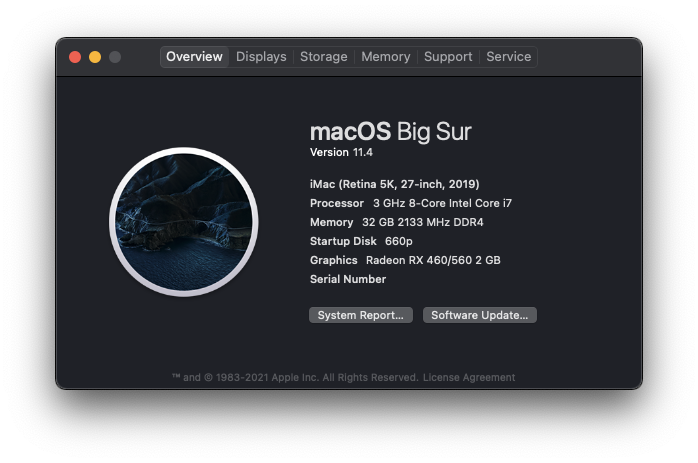

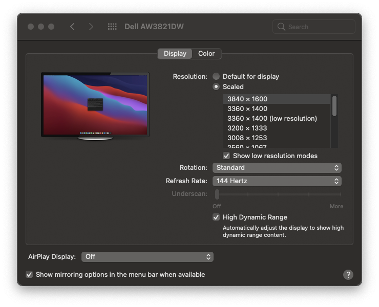

### System Specs
 - Display: Alienware AW3821DW (DisplayPort, 3840x1600@144Hz w/HDR)
 - GPU: AMD RX 460 2GB (DP amd HDMI)
 - CPU: Intel i7-9700
 - RAM: G.SKILL Aegis 32GB (2 x 16GB) DDR4-3200 / [F4-3200C16D-32GIS](https://www.newegg.com/g-skill-32gb-288-pin-ddr4-sdram/p/N82E16820232885)
 - MOBO: HP Lincs (HP 590-p0053w)
   - WiFi: Fenvi T919 used in conjunction with a [m.2 Key A/E to BCM94360CD ribbon adapter](https://www.amazon.com/BQZYX-BCM94360CD-BCM94360CS2-BCM943224PCIEBT2-Hackintosh/dp/B07ZKN3YRC).
   - Ethernet: Realtek 8111
   - Audio Codec: ALC671
 - Storage: 
   - NVMe: Intel 660p 1TB PCle Gen3 x4

### iServices
Status | Function
--|--|
✅ | Sleep
⁇ | Handoff
⁇ | Continuity
⁇ | iMessages
⁇ | AirPlay
⁇ | FaceTime (Video and Audio) w/Logitech C920

### DRM/Video functions
Status | Function | Details
--|--|--
✅ | Video Acceleration |
✅ | Quicklook | 
⁇ | Amazon Prime Video | Chrome
⁇ | Amazon Prime Video | Safari
⁇ | Sidecar | Black screen on iPad
⁇ | Bluetooth - Audio In/Out | Beats Flex

### USB/Audio Ports
Status | Function | Details
--|--|--
✅ | RX 460 HDMI | 3840x1600@144Hz
✅ | RX 460 DP | 3840x1600@85Hz
✅ | iGPU HDMI | 2560x1600@60Hz
❌ | iGPU VGA | 
✅ | Front Panel Audio | Out
✅ | Rear Panel Audio | In/Out
✅ | 1/1 USB 3.1 Type-C | 12/480/5000Mbps (Maybe 10Gbps, untested)
✅ | 4/4 USB 3.0 | 12/480/5000Mbps
✅ | 2/4 USB 2.0 | 2 disabled due to 15 port limit)
✅ | 3/3 SATA | 6Gbps
❌ | Front Audio | In - Headset
⁇ | Rear Audio | In - Line In (Untested)

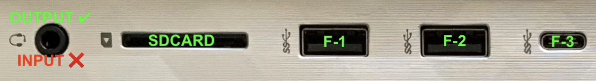
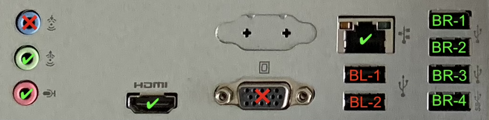

### BIOS Version and Settings
BIOS Settings (Reset BIOS to Factory and apply the following):
 - Device Options
   - NIC PXE Option ROM: Disabled
 - Secure Boot Configuration
   - Legacy Support: Disabled
   - Secure Boot: Disabled
 - System Security
   - TPM Disabled
   - SGX Disabled

### Apple SMBIOS
 - iMac 19,1

### OpenCore Version
 - [0.7.0](https://github.com/acidanthera/opencorepkg/releases)

### Installed Kexts 
| Kext | Release Date | Website|
| --- | --- | ---|
| AppleALC.kext | 2021-06-07 | https://github.com/acidanthera/applealc/releases |
| CtlnaAHCIPort.kext | 2020-08-22 | https://github.com/dortania/OpenCore-Install-Guide/blob/master/extra-files/CtlnaAHCIPort.kext.zip |
| Lilu.kext | 2021-05-03 | https://github.com/acidanthera/lilu/releases |
| RealtekRTL8111.kext | 2021-05-06 | https://github.com/Mieze/RTL8111_driver_for_OS_X/releases |
| VirtualSMC.kext / SMCProcessor.kext | 2021-06-07 | https://github.com/acidanthera/virtualsmc/releases |
| WhateverGreen.kext | 2021-06-07 | https://github.com/acidanthera/whatevergreen/releases |
| USBMap.kext | Generated | https://github.com/corpnewt/USBMap |

### Screenshots
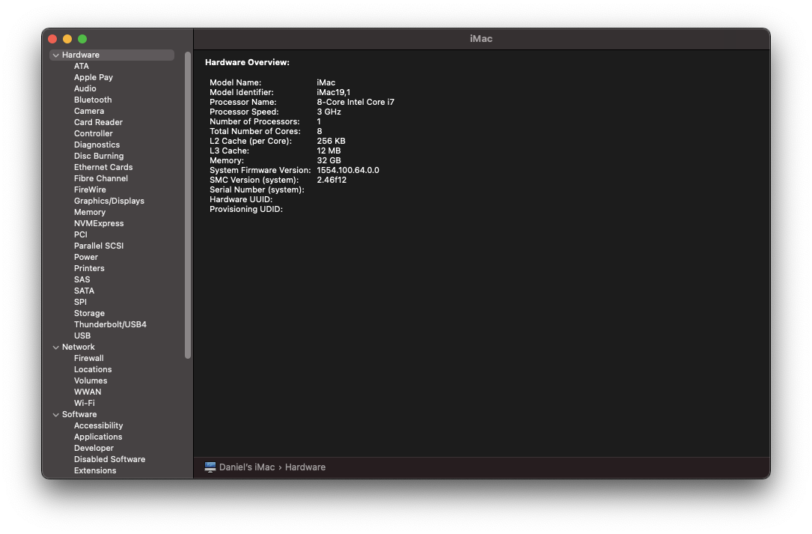
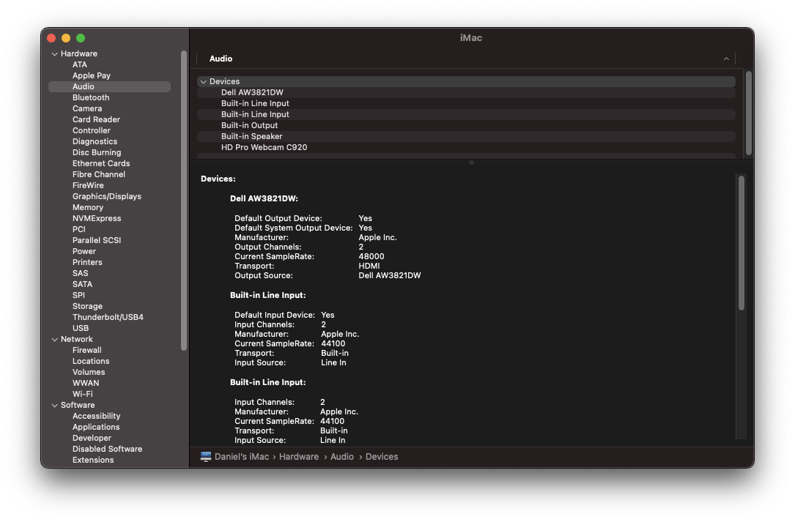
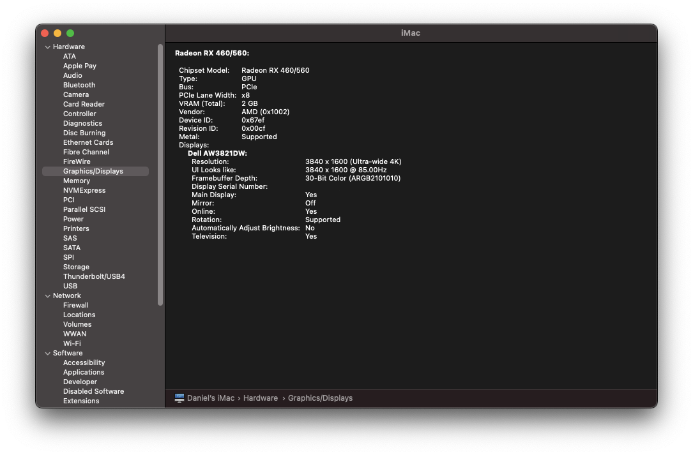
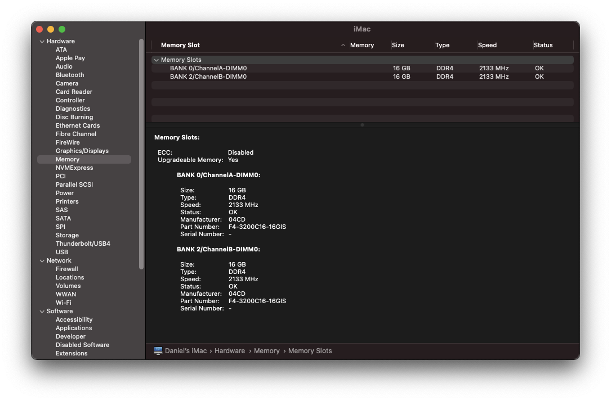
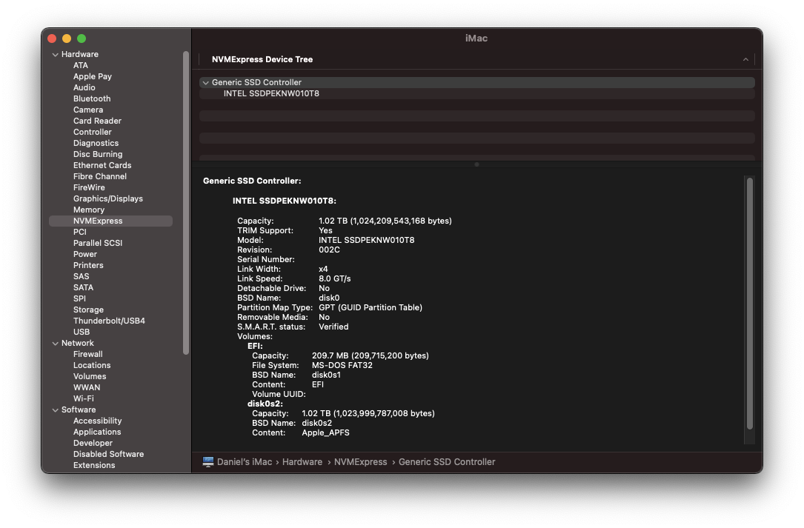
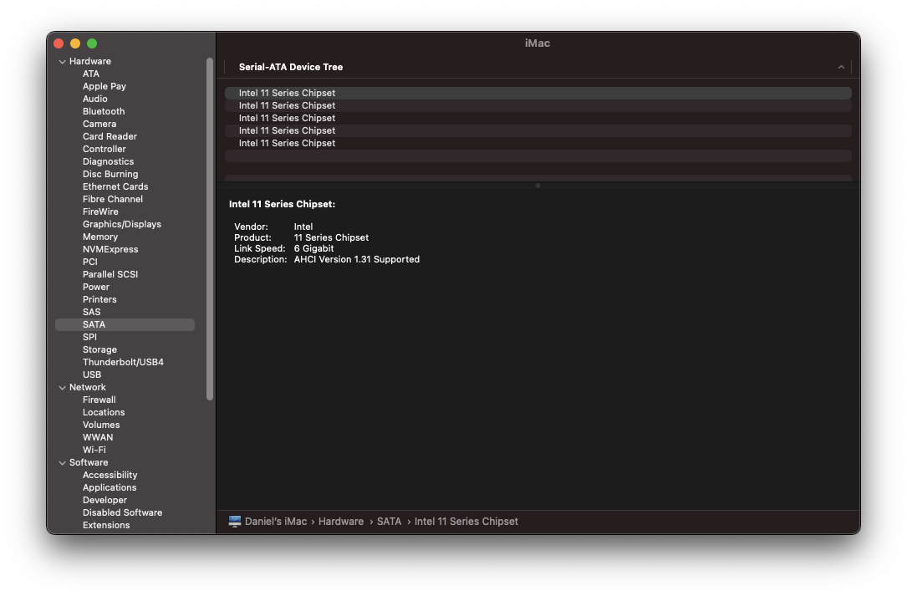
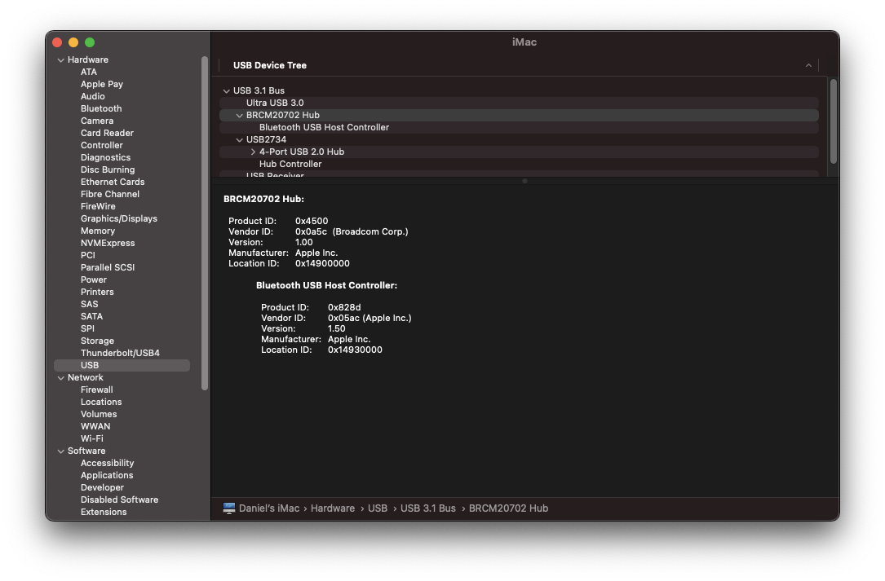
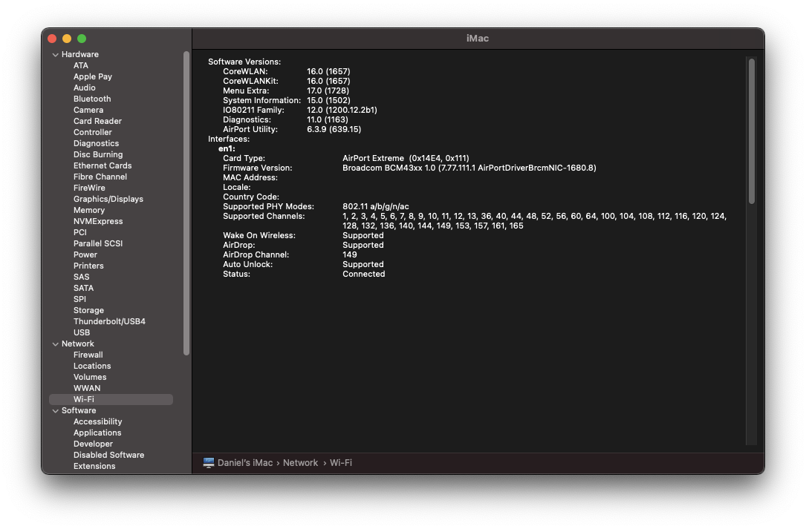
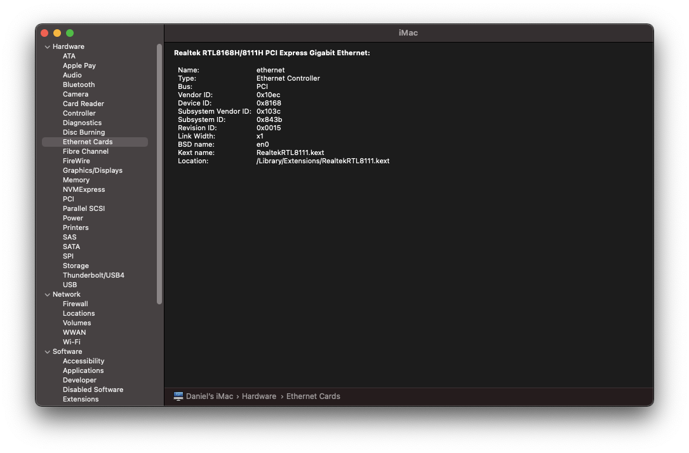


### USBMap
```
    ----- XHC@14 Controller -----
[ ]  1. HS01 | AppleUSB20XHCIPort | 01000000 | 14100000 | Type 0
    BL-2
[#]  2. HS02 | AppleUSB20XHCIPort | 02000000 | 14200000 | Type 3
    F-2
[#]  3. HS03 | AppleUSB20XHCIPort | 03000000 | 14300000 | Type 3
    BR-4
[#]  4. HS04 | AppleUSB20XHCIPort | 04000000 | 14400000 | Type 3
    F-1
[#]  5. HS05 | AppleUSB20XHCIPort | 05000000 | 14500000 | Type 3
    BR-2
[#]  6. HS06 | AppleUSB20XHCIPort | 06000000 | 14600000 | Type 3
    BR-3
[#]  7. HS07 | AppleUSB20XHCIPort | 07000000 | 14100000 | Type 3
    SDCARD
[ ]  8. HS08 | AppleUSB20XHCIPort | 08000000 | 14200000 | Type 3
    BL-1
[#]  9. HS09 | AppleUSB20XHCIPort | 09000000 | 14300000 | Type 3
    BR-1
[ ] 10. HS10 | AppleUSB20XHCIPort | 0a000000 | 14400000 | Type 3
[#] 11. HS11 | AppleUSB20XHCIPort | 0b000000 | 14800000 | Type 3
    F-3
[ ] 12. HS12 | AppleUSB20XHCIPort | 0c000000 | 14500000 | Type 3
[ ] 13. HS13 | AppleUSB20XHCIPort | 0d000000 | 14600000 | Type 3
[#] 14. HS14 | AppleUSB20XHCIPort | 0e000000 | 14900000 | Type 255
    Internal
[ ] 15. USR1 | AppleUSB20XHCIPort | 0f000000 | 14700000 | Type 3
[ ] 16. USR2 | AppleUSB20XHCIPort | 10000000 | 14800000 | Type 3
[#] 17. SS01 | AppleUSB30XHCIPort | 11000000 | 14a00000 | Type 3
    BR-4
[#] 18. SS02 | AppleUSB30XHCIPort | 12000000 | 14b00000 | Type 3
    BR-3
[#] 19. SS03 | AppleUSB30XHCIPort | 13000000 | 14900000 | Type 3
    F-1
[#] 20. SS04 | AppleUSB30XHCIPort | 14000000 | 14d00000 | Type 3
    F-2
[ ] 21. SS05 | AppleUSB30XHCIPort | 15000000 | 14a00000 | Type 3
[ ] 22. SS06 | AppleUSB30XHCIPort | 16000000 | 14b00000 | Type 3
[#] 23. SS07 | AppleUSB30XHCIPort | 17000000 | 14e00000 | Type 3
    F-3
[#] 24. SS08 | AppleUSB30XHCIPort | 18000000 | 14f00000 | Type 3
    F-3
```

### Set to retina panel scale down from superres:
```bash
brew tap jakehilborn/jakehilborn
brew install displayplacer
displayplacer list
  mode 223: res:3840x1600 hz:144 color_depth:8 <-- current mode
  mode 167: res:3840x1600 hz:144 color_depth:8 scaling:on

displayplacer "id:<id_here> mode:167"

displayplacer list
  mode 167: res:3840x1600 hz:144 color_depth:8 scaling:on <-- current mode
Execute the command below to set your screens to the current arrangement:
  displayplacer "id:<id_here> res:3840x1600 hz:144 color_depth:8 scaling:on origin:(0,0) degree:0"
```

### Sanitization script
```bash
plistOriginal='/Volumes/EFI/EFI/OC/config.plist'
plistPath='/Volumes/EFI/EFI/OC/config-sanitized.plist'
cp -f "${plistOriginal}" "${plistPath}"

clearedFields=('SystemSerialNumber' 'SystemUUID' 'MLB' 'ROM')
for clearedField in ${clearedFields[@]}; do
  /usr/libexec/PlistBuddy -c "Set :PlatformInfo:Generic:${clearedField} 0" "${plistPath}"
done

/usr/libexec/PlistBuddy -c "Print :PlatformInfo:Generic" "${plistPath}"
```
